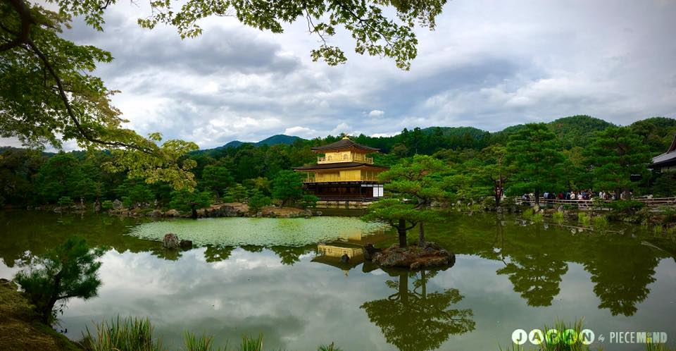

# Neural-Style-Transfer
Tensorflow Implementation of Neural Artistic Style Transfer using VGG-19.

### Non-Standard Packages and Dependencies :
<ol>
  <li> Tensorflow GPU (1.12 ; CUDA 9.2)- (https://www.tensorflow.org/install </li>
  <li> SciPy - https://pypi.org/project/scipy/ </li>
  <li> NumPy - https://pypi.org/project/numpy/ </li>
  <li> Pillow - https://pypi.org/project/Pillow/ </li>
  <li> Matplotlib - https://pypi.org/project/matplotlib/ </li>
</ol>

### References 
<ol>
  <li> Based on implementation by - https://github.com/Aparnaakk/Neural_style_transfer </li>
  <li> Artistic Style Transfer with Convolutional Neural Network- https://medium.com/data-science-group-iitr/artistic-style-transfer-with-convolutional-neural-network-7ce2476039fd </li> 
  <li> A Neural Algorithm of Artistic Style - https://arxiv.org/abs/1508.06576 </li>
  <li>A Literature Review of Neural Style Transfer https://www.cs.princeton.edu/courses/archive/spring18/cos598B/public/projects/LiteratureReview/COS598B_spr2018_NeuralStyleTransfer.pdf </li>
  
## Summary

### Approach
<ol>
  <li> Image parameters for the required content and style image are specified, followed by hyperparameters beta, alpha and learning rate </li>
  <li> Pre-Processing function for input is specified, where image is read, reshaped as per specifications and then the mean values are subtracted from the image. Output reconstruction is specficed which subsequently re-add the mean values.</li>
  <li> VGG-19 Model defintions are loaded, as per architecture, biases and weights are intialized and convolution and pooling layer parameters are specified.</li>
  <li> Function for generating white gaussian noise image is created, it is parameterized by the content image </li>
  <li> Content Loss is specified as per formula, and is computed as the mean squared error between feature map of content image        and the feature map of the generated image. Similarly Gram matrix of each feature map, and the style loss which is mean-   squared error between gram matrices and the raw tensor outputs of the style layers. </li>
  <li> Session is created, the noisy content image is created, and the style image is also initialized, subsequently the content loss, and style loss is computer, then by formula, total loss is calculated and minimized using Adam optimizer. </li>
  <li> The output image is saved and displayed </li>
</ol>

### Key Learning Points and Takeaways: 
<ol>
  <li> Exploiting similarity of semantic content between differently stylized images, is a primary motivation for using style transfer in the used formulation </li>
  <li> The process can be visualized as a style image serving as a filter, being convolved with the content image input. </li>
  <li> Due to lack of variational information, the stylization does not have temporal coherence when style transferred, so alternate approaches are required when applying the algorithm to video or temporally varying data, like optical flow </li>
  <li> There is a tendency of the algorithm to preserve the colors and texture of the style. </li>
  <li> The feature complexities and receptive field sizes increase down the CNN heirarchy. </li>
  <li> L-BFGS provides the best performance but since not directly implemented in the system, Adam is preferred. </li>
  <li> Fast Style Transfer, a significantly faster variant, can be trained on a single style, parameterizing the entire network, and this allows for significantly faster inference, by orders of magnitude, though it takes longer to train a-priori. </li>
  <li> VGG based architectures like VGG-19 and VGG-16 are more suitable, because ot does not downsample as aggressively as GoogLeNet, and the features are not as spread apart in ResNets due to larger depth and tend to be mixed up, hence, DenseNets would work better than ResNets but worse than VGG, which is shallower and more coherent feature wise.
  <li> Adam Optimizer might face gray region issues, on digital painting work, which can be mitigated by tuning its hyperparameters specifically tuning the epsilon (numerical stability) of the optimizer. </li>
  </ol>
  
  
 ## Example
  #### Content Image
  
  #### Style Image
  
  #### Output Image
  

  
### Trained using :
**CPU** : AMD Ryzen 2700X\
**GPU :** Titan X\
**Memory :** 16 GB\
**CUDA Version** : 9.2\
**cudNN Version** : 7.1.2\
**Tensorflow-GPU version** : 1.12.0
